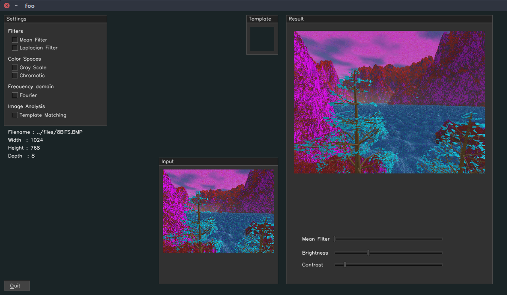
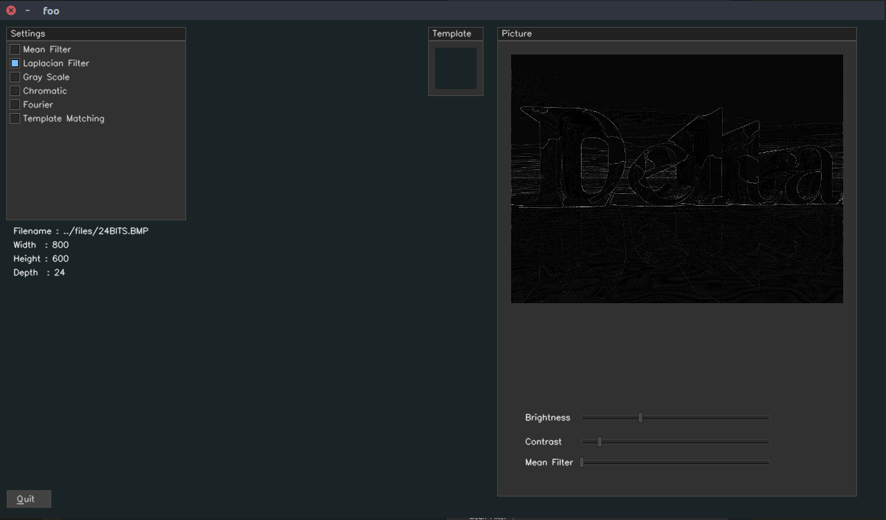
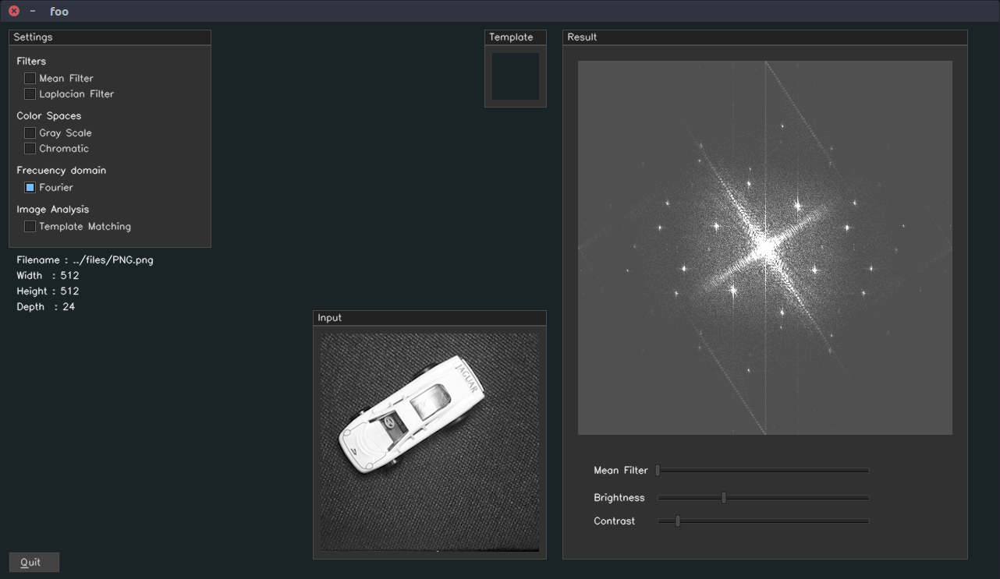
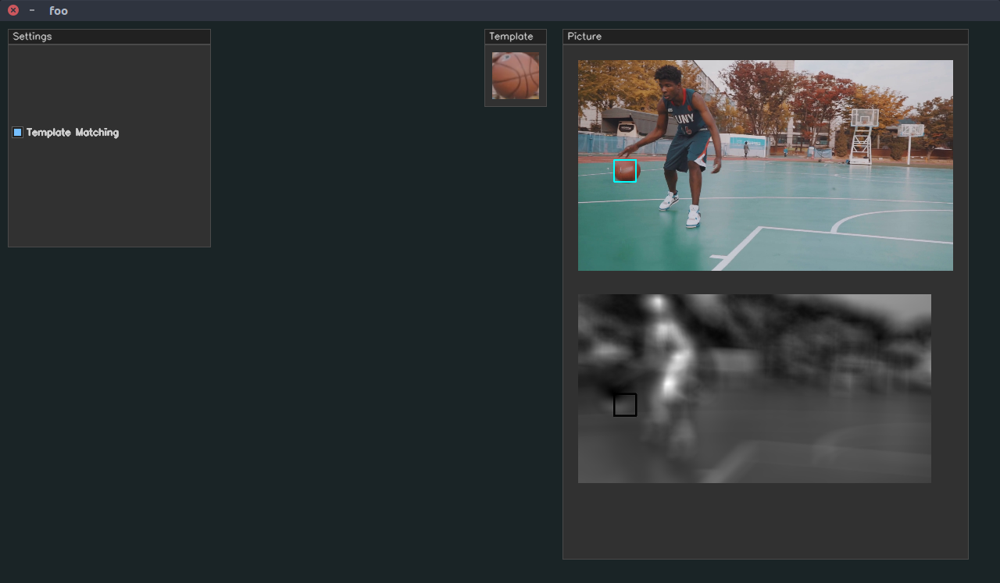

# Image Processing GUI (C++ and CUDA)

**Ver demostración en** [Vimeo](https://vimeo.com/306504977).

### Crear el ejecutable

```
mkdir build
cd build
cmake ..
make
```

### Ejecución:

1. Abrir directamente el programa con una imagen BMP por defecto.
```
./imgpro
```

2. Abrir una imagen en formato BMP.
```
./imgpro 1BIT.BMP       #4BITS.BMP, 8BITS.BMP, 24BITS.BMP
```
2. Abrir imagens PNG, JPG, ...
```
./imgpro -t PNG.png
```

### Funciones
1. Adquisición y representación de imágenes:
    - Escritura y lectura de archivos BMP de 1, 4 ,8 y 24 bits.
2. Procesamiento global de imágenes:
    - Constraste.
    - Brillo.
3. Filtros:
    - Mean Filter.
    - Laplacian Filter.
4. Transformationces Geometricas:
    - Transformaciones bilineales.
5. Espacios de color y dominio de frecuencia:
    - Escala de grises.
    - Coordenas cromáticas.
    - Transformada de Fourier.
    - Transformada Wavelet.
6. Análisis de imágenes
    - Template matching: Con suma de diferencias al cuadrado normalizadas.

### Interface Grágica

Para una imagen BMP de 8 bits.
```
./imgpro 8BITS.BMP
```


### Filtro Laplaciano
Para una imagen PNG.
```
./imgpro -t lenna.png
```


### Transformada de fourier
Para una imagen PNG.
```
./imgpro -t car.png
```


## Template matching
Seleccionar la casilla **Template Matching**.<br><br>


## Instrucciones
1. La barra de **Mean Filter** solo está activada cuando se activan la casillas **Mean Filter** o **Fourier**, en este último caso la funcion de Transformada de Fourier se ejecuta sobre la imagen despues de aplicar la función **Mean Filter**.

2. La barras de **Brightness** y **Contrast** solo estan activadas cuando no se tiene activa la casilla **Fourier**; esto para lograr una mejor visualización.

3. Para la lectura de archivos es necesario colocarlos dentro de la carpeta **files**.

## Programa
La interfaz gráfica esta hecha en [CVUI](https://github.com/ocornut/imgui), una libreria basada en OpenCV que
permite un fácil manipulacion de los elementos de una ventana. Las funciones fueron realizadas en **CUDA** y enlazadas
al programa principal en C++.

## Requerimientos
1. OpenCV 2.4.9
2. GCC version 5.4
3. Cuda Toolkit 9.0
4. Targeta Gráfica GTX 780 Ti
5. CMake 3.10 [Link](https://www.claudiokuenzler.com/blog/755/install-upgrade-cmake-3.10.1-ubuntu-14.04-trusty-alternatives#.XBCpRhC22kA)